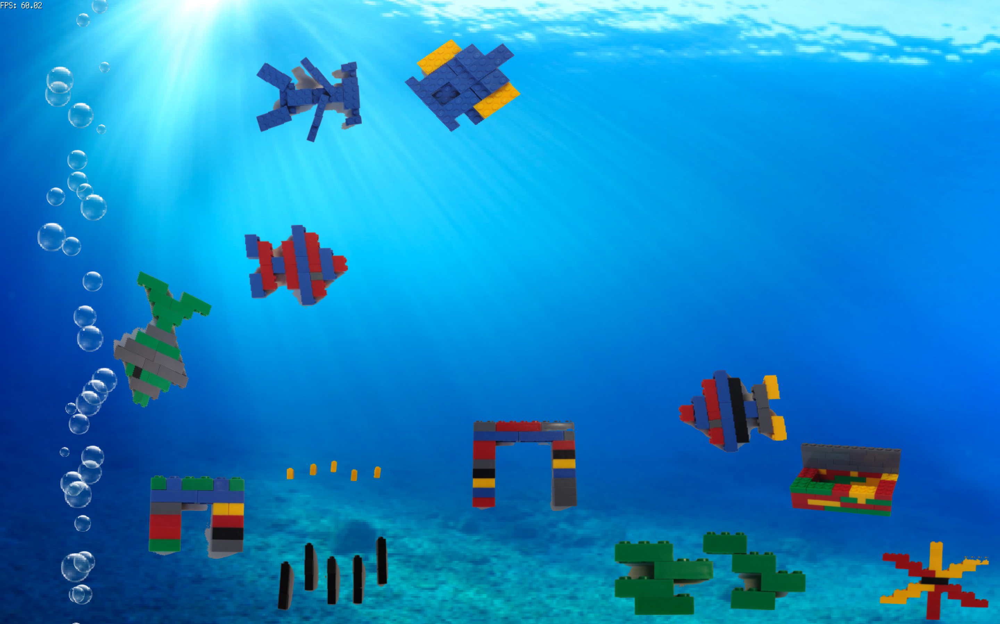

# aquago
A Digital Aquarium written in go

Which is something like this (depend on your fishes and decorative elements!):



## Aquarium Content

Our digital aquarium is consisted of four separate entities:

* The background - a static image which is the seabed
* The bubbles - some decorative bubbles as real aquariums have
* The BG items - decorative items which can be dragged and placed round the seabed
* The FG items - the "alive" organisms of the digital aquarium which "freely" move around

In order to run this application read the following steps.

## Prerequisites

* a supported Go version with modules enabled
* a Google Drive account
* an installed C compiler (for [ebiten](https://ebiten.org/documents/install.html))

## Clone this repo

Clone this repo by running

```console
git clone https://github.com/mzampetakis/aquago.git
```

## Configuration

### Env Vars
Before running the app all configuration must be set. The configuration can be added an Env Vars or inside the provided `.env` file. The variables are:

```
# GDrive Folders
# Folder ID to retrieve BG items
BGFOLDERID=1EDCChSY0ujjrpL-fK0S4R89zpWxLYcHS
# Folder ID to retrieve FG items
FGFOLDERID=1065nob35R6cIgB_aUIcW4fOwMV6D9oiS

#Saved Assets
# Image to use as background
BGIMAGE=assets/bg4.png
# Folder to save downloaded BG items
GDRIVEBGSFOLDER=assets/gdrive/bg/
# Folder to save downloaded FG items
GDRIVEFGSFOLDER=assets/gdrive/fg/
# Folder to save processed BG items
BGSFOLDER=assets/bg/
# Folder to save processed FG items
FGSFOLDER=assets/fg/
# Wether to remove saved assets - used to retrieve only the latest active assets
CLEARASSETS=true

#Google Drive Credentials file
GDRIVE_CREDS_FILE=credentials.json
```

### Google Drive oAuth

In order to setup the Google's Drive API oAuth please read the documentation provided in the [corresponding repo](https://github.com/mzampetakis/gogle-drive).

## Running the app

When configuration is ready you can run the app by executing:

```console
go run main.go
```

After proceeding with the Google's Drive oAuth steps as [presented here](https://github.com/mzampetakis/gogle-drive) the application will start to download and transform the assets. After a while (depending on your assets) you will see something like the following.

## Result

If no items are found within your Google Drive you will see something like this:


If you have added assets in your Google Drive you will see something like this (Depending on your assets): 


